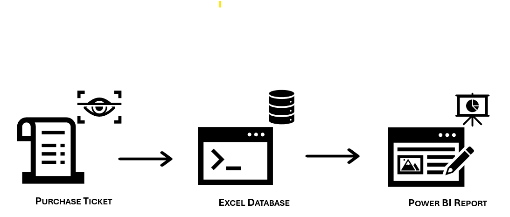
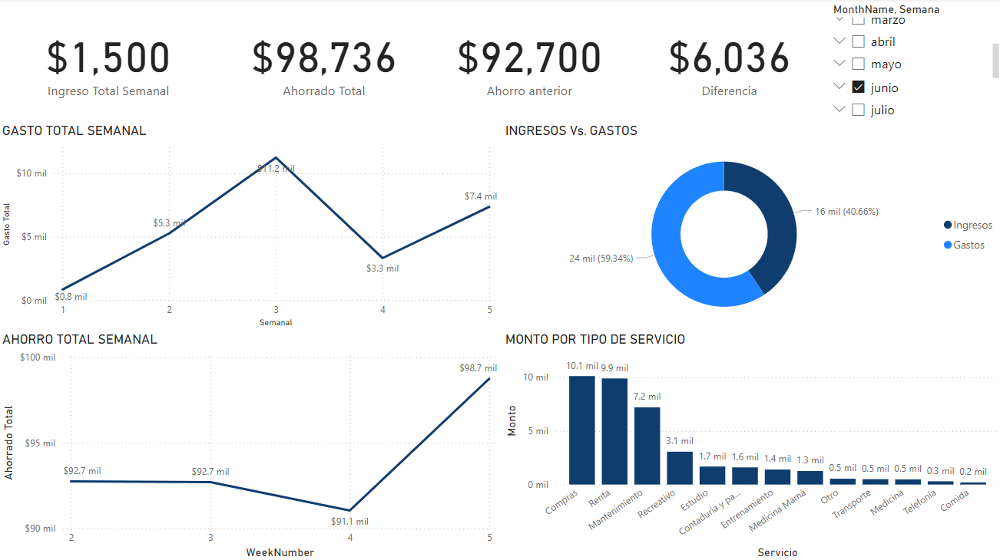

# Automated Financial Assistant | Asistente Financiero Automático
## From Receipts to Insights with OCR and Power BI
---
This project is a comprehensive expense management system that utilizes OCR (Optical Character Recognition) to convert purchase receipts into Excel tables. The data is then analyzed and visualized using Power BI to provide detailed weekly and monthly expense reports.

    
    

## Project Structure

### 1. OCR of Receipts with Python
The project employs OCR technology to convert physical purchase receipts into digital text. This step involves capturing images of receipts and processing them to extract structured data.

### 2. Automatic Excel creation
The data extracted from the OCR process is **automatically organized into structured Excel tables**. These tables form the basis for further data analysis and visualization.

### 3. Power BI Reports
Power BI is used to create detailed and interactive expense reports. These reports provide insights into weekly and monthly spending patterns, helping users manage their finances effectively.

### 4. Use of DAX
Data Analysis Expressions (DAX) are used within Power BI to create calculated columns and measures, enabling advanced data analysis and customized reporting.

## Visual Resources

### Power BI Report Example

*Description*: An example of a weekly expense report generated using Power BI.
